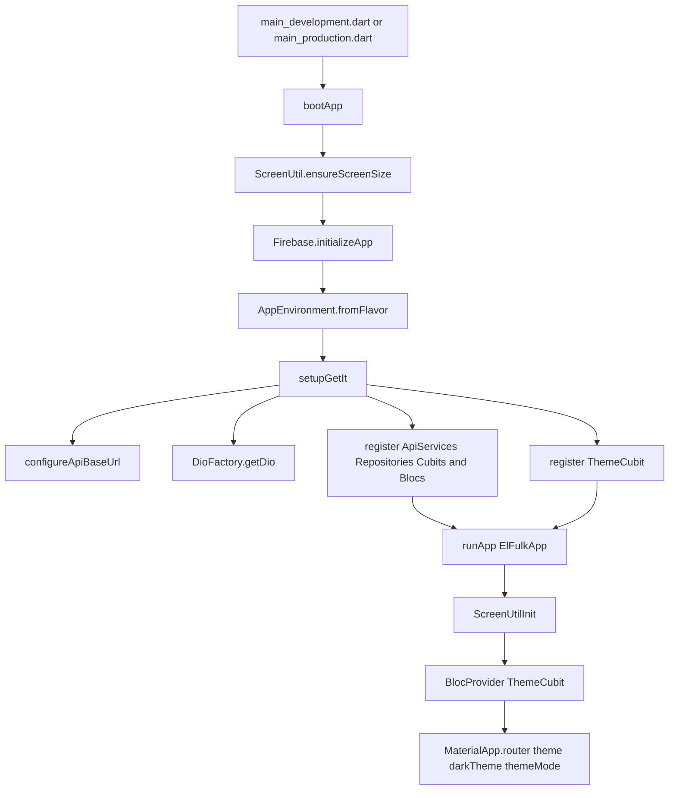
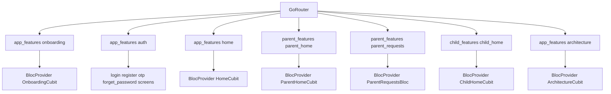
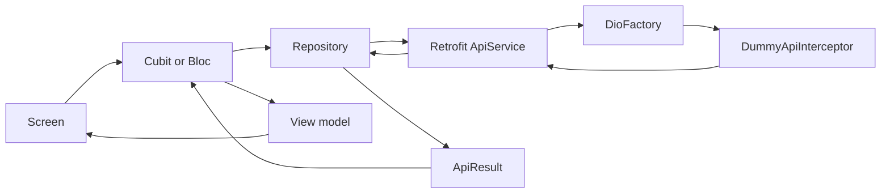

# ElFulk Architecture Diagrams

ElFulk currently uses a feature-first Flutter structure with GetIt dependency injection, GoRouter navigation, Bloc/Cubit state management, ScreenUtil-based responsive sizing, and Retrofit networking over a shared Dio client. The backend layer is currently satisfied by a dummy Dio interceptor so the app stays runnable without a live server.

## 1) Startup and DI



## 2) Routing and feature groups



## 3) Networking flow



## 4) Folder structure

```text
lib/
  main_development.dart
  main_production.dart
  src/
    app/
      boot/
        boot_app.dart
    core/
      app/
        elfulk_app.dart
      config/
        app_environment.dart
        di/
        routing/
        firebase/
      constants/
        app_breakpoint.dart
        app_raduis.dart
        app_spacing.dart
      helpers/
        helpers.dart
        src/
          utils/
      networking/
        app/
        parent/
        child/
        error/
        helper/
      theme/
        app_colors.dart
        app_theme.dart
        logic/
          cubit/
            theme_cubit.dart
            theme_state.dart
      widgets/
        app_screen_template.dart
        app_section_card.dart
        custom_text_field.dart
        divider_with_text.dart
        footer_text.dart
        primary_button.dart
        social_button.dart
        theme_toggle_button.dart
    features/
      app_features/
        onboarding/
        auth/
        home/
        architecture/
      parent_features/
        parent_home/
        parent_requests/
      child_features/
        child_home/
```
